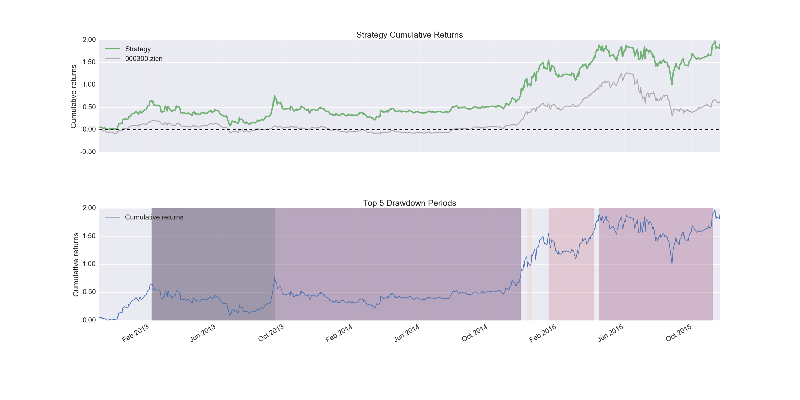

.. _helloworld:

Hello World！
-------------------

这里我们会给出一个最简单的“策略”，最主要的是帮助用户了解在 ``AlgoTrading`` 下编写策略的流程。

1. *导入模块的功能*

.. ipython::

    In [1]: from AlgoTrading.api import *
	
2. *自定义策略*

.. ipython::

    In [2]: class UserStrategy(Strategy):
       ...:     def __init__(self):
       ...:         pass
       ...:     def handle_data(self): 
       ...:         self.order('600000.xshg', 1, 100)
	   
3. *运行策略*

.. ipython::

   In [3]: %%time
      ...: import datetime as dt
      ...: res = strategyRunner(userStrategy=UserStrategy, \
      ...:                      symbolList=['600000.xshg'], \
      ...:                      startDate=dt.datetime(2012, 1, 1), \
      ...:                      endDate=dt.datetime(2015, 11, 30), \
      ...:                      benchmark='000300.zicn')
      
你可以看到如下所示的回测结果输出：

	策略运行回测结果