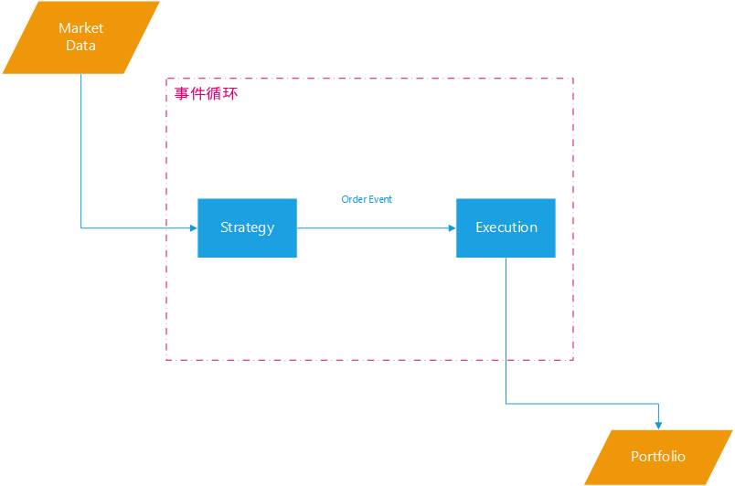

.. _strategy:

策略
----------------------

.. index:: 策略

.. index:: strategy

``AlgoTrading`` 中的策略
^^^^^^^^^^^^^^^^^^^^^^^^^^^

**策略** 是 ``AlgoTrading`` 框架下的核心。作为 *事件循环* 的主要中转点，策略负责将 ``MarketEvent`` 转化为 ``OrderEvent``
并将其推送至队列中供 ``Execution`` 使用：

	策略与其他组件的交互

自定义策略
^^^^^^^^^^^^^^^^^^^^^^^^^^^^

对于用户而言，策略的逻辑需要他来给出，而给出的方式就是定义如下的自定义策略类型：

.. code-block:: python

    class UserStrategy(Strategy):
        ...

在这个自定义的策略下，用户需要完成两个成员：

* ``__init__``

  初始化函数，在策略启动的时候运行，主要用于定义比如：

  1. 全局变量
  2. 指标（由Finance-Python模块提供）

* ``handle_data``

  行情数据处理函数，每根bar推送至回测引擎时候出发。这里是用户交易逻辑的主要定义点。

策略的成员
^^^^^^^^^^^^^^^^^^^^^^^^^^^^

策略的基类 ``Strategy`` 中已经定义了很多成员作为交易的功能函数，例如：下单、获取证券列表等功能。特别需要关注的，例如：

* ``order``

   ``order`` 函数按照指定方向交易指定证券，交易的数量由 ``quantity`` 参数确定，例如：

   .. table:: ``order`` 前账户持仓

      ======== ============
      证券代码  数量
      ======== ============
      600000   200
      000001   300
      ======== ============

   在下达 ``order('600000', direction=1, quantity=300)`` 的指令后：

   .. table:: ``order`` 后账户持仓

      ======== ============
      证券代码  数量
      ======== ============
      600000   500
      000001   300
      ======== ============

* ``order_to``

   ``order_to`` 函数按照指定方向交易指定证券，交易的目标由 ``quantity`` 参数确定，例如：

   .. table:: ``order_to`` 前账户持仓

      ======== ============
      证券代码  数量
      ======== ============
      600000   200
      000001   300
      ======== ============

   在下达 ``order_to('600000', direction=1, quantity=300)`` 的指令后：

   .. table:: ``order_to`` 后账户持仓

      ======== ============
      证券代码  数量
      ======== ============
      600000   300
      000001   300
      ======== ============

* ``tradableAssets`` 属性

   该属性会返回当前行情bar下，可交易证券列表。例如用户订阅了包含3个代码的行情信息：60000、IF1512以及000300。那么在 ``tradableAssets``
   属性下会返回的只会包含600000以及IF1512，而指数代码000300则不会在其中。

* ``avaliableForTrade``

   该方法返回指定证券在当前账户中的可交易数量（包括可买入和可卖出）。该方法会正确处理例如T+1交易方式惯例，例如：用户在2015年12月21日开盘时刻通过 ``order`` 指令
   下单购入某A股300股并且成功成交。那么在当天任意一根bar上调用 ``avaliableForTrade`` 函数获取的可交易数量都为 ``(0, 0)`` 。在下一个交易日，可交易数量会被更新为
   ``(300, 0)`` 。

* ``keep``

   该函数提供了常用的用户自定义日志功能，其中：

   ``label`` : 值的名称，它将在最后生成的用户信息 ``DataFrame`` 中以列名的形式出现；
   ``value`` : 值的信息，一般来说是一个数字或者字符串等；
   ``time``  : 值的时间戳，会出现在 ``DataFrame`` 中的行坐标中。默认为None，使用当前的bar时间戳。

   例如一个典型的对应：

   .. code-block:: python

      lable('signal', 2.0)
      label('index', 4.0)

   最后生成的用户信息表可能如下：

   ========== ============ ============
   timeStamp  signal       index
   ========== ============ ============
   2015-12-21 2.0          4.0
   ========== ============ ============

策略模块
^^^^^^^^^^^^^^^^^^^^^^^^^

.. autoclass:: AlgoTrading.api.Strategy
   :members: